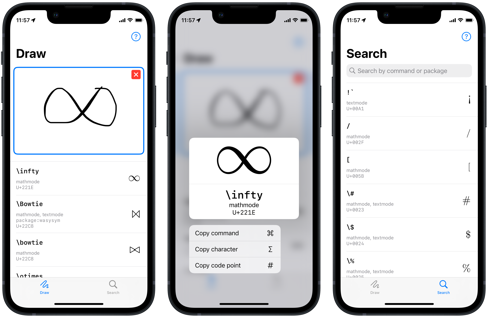

# DeTeXt

Finding the symbol you want to use in LaTeX can be hard since you can't memorize
all the possible commands and packages for every symbol you might need to use
in your document. DeTeXt tries to solve this problem by giving you two ways to
find the command you want:

- Draw the symbol you want and DeTeXt's neural image classification engine will
 identify what it thinks are the 20 most likely LaTeX symbols that look like
 the one you drew, arranged in order of decreasing confidence.

- Search the entire symbol set within the app, even if you only remember part
of the name of the symbol and/or command. The app has 1098 symbols including
all default mathematical symbols, and symbols from packages like tipa, amsmath,
amssymb, textcomp and more.

- Copy the symbol, or the character itself, or its Unicode codepoint to the system clipboard to paste anywhere else.

DeTeXt was built using SwiftUI, PencilKit, CoreML and Combine.

[Download DeTeXt from the App Store!](https://apps.apple.com/us/app/id1531906207)

Code used to generate drawings, figures and the image classification model can
be found in the [supplementary repository](https://github.com/venkatasg/DeTeXt-Supplementary)

**Note**: The main branch of this repository is built for iOS 15, and uses new APIs introduced with that release. Switch to the iOS-14 branch to run/test on devices with iOS 14.
